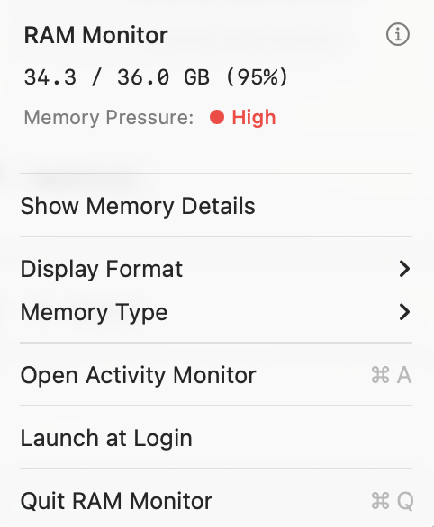

# RAM-Monitor

RAM Monitor is a lightweight menu bar utility that displays your Mac's memory usage in real-time.

Choose between percentage, gigabytes, or megabytes, monitor memory pressure levels, and access detailed breakdowns of wired, active, inactive, compressed, and free memory. 

One-click access to Activity Monitor and minimal system overhead.

